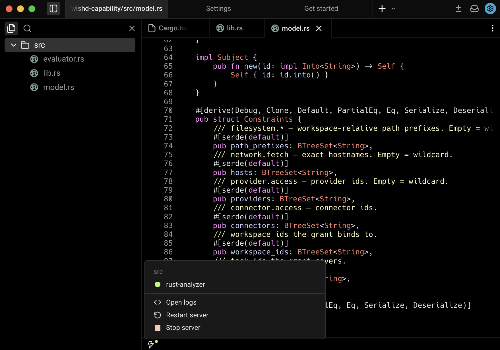

# Wish

Wish is the Hermon AI agentic development environment derived from the open-source Warp client. It keeps the fast native terminal, code workspace, agent workflows, code review surfaces, and WishUI foundation, while aligning the product experience with Hermon AI.



Useful links:

- [Wish product site](https://wish.hermon.ai)
- [Hermon AI](https://www.hermon.ai)
- [Wish repository](https://github.com/hermonai/wish)
- [Hermon backend repository](https://github.com/hermonai/hermon)
- [Upstream Warp repository](https://github.com/warpdotdev/warp)

## Scope

Wish is a pure Warp-to-Wish rebrand and Hermon AI alignment project in this phase. It is focused on:

- Terminal workspace
- Code and file workspace
- Agent mode
- CLI agent hosting
- Code review and Git workflows
- WishUI and WishUI Core
- Local-first development workflows
- Hermon backend integration boundaries

Storm, Finalverse, 3D scene views, spatial UI, and `wishui-3d` are intentionally out of scope for this repository.

## Local Development

To build and run Wish from source:

```bash
./script/bootstrap
./script/run
./script/presubmit
```

For a direct debug build of the OSS binary:

```bash
cargo run --bin wish-oss
```

See [WISH.md](WISH.md) for engineering conventions, build notes, test guidance, and codebase orientation.

## Local-First Behavior

Wish should be useful without requiring a backend login at launch. Local terminal, editor, code review, and local agent surfaces should remain available wherever possible. Cloud-backed services such as hosted auth, team governance, Drive sync, hosted model routing, billing, and remote orchestration are routed through the Hermon backend boundary.

Local Ollama model discovery is supported for free local model availability when Ollama is running. Cloud-backed model lists should not block local use.

## WishUI

WishUI is the native UI foundation for Wish:

- `crates/wishui-core` owns backend-neutral UI concepts such as app/entity model, elements, layout, input, actions, scene, rendering-neutral GPU metadata, and theme/tokens.
- `crates/wishui` owns concrete platform/rendering/window integration such as native windows, Metal, WGPU, text/glyph rendering, image/texture cache, and frame scheduling.

The current WishUI scope is terminal/editor/agent workspace UI. It does not include 3D or spatial UI.

## Hermon Backend

Hermon is the backend control plane for Wish, providing multi-provider AI routing, conversation persistence, agent orchestration, and cloud services.

### What works today

- **Multi-provider AI streaming** via `POST /v1/ai/chat` with full tool-use lifecycle events (Anthropic, OpenAI, Gemini, Grok, Ollama)
- **OpenAI-compatible surface** at `POST /v1/chat/completions` for drop-in compatibility
- **Conversation persistence** with SQLite-backed local storage and cloud sync
- **Wish Drive** for notebook, workflow, and file management
- **Agent orchestration** with streaming tool-use events (`ToolUseStart`, `ToolUseDelta`, `ToolUseComplete`)

### Configuration

| Variable | Purpose |
|----------|---------|
| `HERMON_API_URL` | Hermon server base URL (default: `http://localhost:9100`) |
| `ANTHROPIC_API_KEY` | Enables Anthropic/Claude models |
| `OPENAI_API_KEY` | Enables OpenAI models |
| `GEMINI_API_KEY` | Enables Google Gemini models |
| `XAI_API_KEY` | Enables Grok models |

Ollama is always available when running locally (no key needed). Each provider supports `*_BASE_URL` overrides.

See also:

- [Hermon Backend Integration](docs/HERMON_BACKEND_INTEGRATION.md)
- [Wish/Hermon Protocol Boundary](docs/WISH_HERMON_PROTOCOL_BOUNDARY.md)

## Licensing and Attribution

Wish preserves upstream Warp legal notices and attribution. See [Upstream Attribution](docs/UPSTREAM_ATTRIBUTION.md).

- The client app is licensed under [AGPL v3](LICENSE-AGPL).
- WishUI and WishUI Core are licensed under [MIT](LICENSE-MIT).
- New original Wish work may carry Hermon AI copyright notices.
- Files derived from upstream Warp should preserve upstream notices.

## Contributing

Read [CONTRIBUTING.md](CONTRIBUTING.md) before opening issues or pull requests. In short:

- Keep changes focused.
- Preserve upstream attribution and legal notices.
- Prefer local-first behavior when a backend is unavailable.
- Keep product-facing language Wish/Hermon, except in explicit upstream attribution or third-party dependency contexts.
- Run formatting and checks before submitting:

```bash
cargo fmt --all
cargo check --workspace
```

## Support and Security

- File bugs and feature requests in [GitHub Issues](https://github.com/hermonai/wish/issues).
- Report security issues privately via [GitHub Security Advisories](https://github.com/hermonai/wish/security/advisories/new) or [security@hermon.ai](mailto:security@hermon.ai).
- Use [SECURITY.md](SECURITY.md) for the disclosure policy.

## Selected Open Source Dependencies

Wish builds on a large Rust and systems ecosystem, including:

- [Tokio](https://github.com/tokio-rs/tokio)
- [NuShell](https://github.com/nushell/nushell)
- [Fig Completion Specs](https://github.com/withfig/autocomplete)
- [Warp Server Framework](https://github.com/seanmonstar/warp)
- [Alacritty](https://github.com/alacritty/alacritty)
- [Hyper](https://github.com/hyperium/hyper)
- [FontKit](https://github.com/servo/font-kit)
- [Smol](https://github.com/smol-rs/smol)
